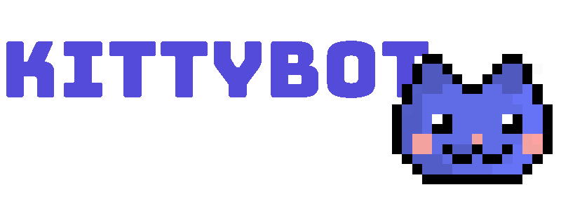

Fresh Golang rewrite of the [KittyBot](https://github.com/KittyBot-Org/KittyBot) project.

Optional CLI Flags:

- `--sync-commands=true`: Synchronize commands with the discord.
- `--sync-db=true`: Synchronize database.
- `--exit-after-sync=true`: Exit after db & commands sync.
